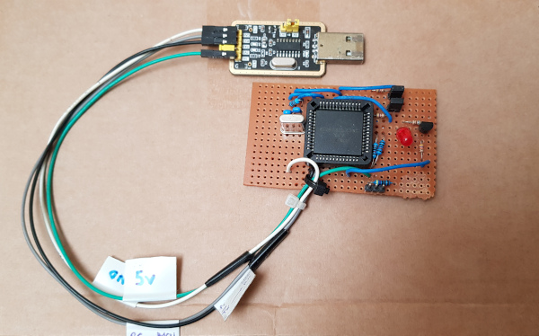
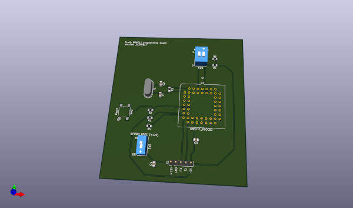

Tru11
-----

A command line program for reading and writing Motorola 68HC11 series microcontroller (MCU).

Example devices:
MC68HC11E1
MC68HC11E9
MC68HC711E9
MC68HC11E20
MC68HC711E20
MC68HC811E2

The MCU must start in the bootstrap mode with an 8MHz crystal.
The mode can be selected by connecting MODA + MODB pins to ground.

In bootstrap mode, the built-in bootloader program in the ROM will execute, which then waits for the host to send it a user program to place into RAM, and then executes it by jumping to RAM address 0x0000.

This command line program requires the tru11 talker program (talker firmware) to be downloaded into the MCU RAM first.

TBug11
------

This is an alternative program to Tru11, which achieves the same thing but uses JBug11 talker firmware (by John Beatty) instead.
The original JBug11 firmware is interrupt driven, and this requires the XIRQ or IRQ pins to be pulled up to VDD (5V supply).  But on my minimal programming board, these are floating and so will not work.
I've modified the firmware, adding in a new option (made default) for a polling method, which enables the minimal programming board to work.

68HC11 programming board
------------------------

The schematics folder contains KiCad EDA files for a minimal and standard programming board with a PLCC52 socket.

The minimal version is enough for reading (all) and writing registers, RAM, EEPROM, but not EPROM.

The standard includes:
- DIP switches for boot mode options
- 12V input to support writing EPROM
- Reset button

On both versions, there is a header with 5V input supply and 5V TTL serial pins, which you can wire directly to a serial TTL-to-USB adapter, e.g. CH340 (plenty on ebay) or FT232 ready made board, please set the jumper to 5V if the board has the option.

Example run scripts
-------------------

The example run scripts make use of the settings in the script:
env_win.bat (if using Windows)
env_linux.sh (if using Linux)

Edit the script with the correct serial port path, then run:
upload_talker.bat (if using Windows)
upload_talker.sh (if using Linux)
